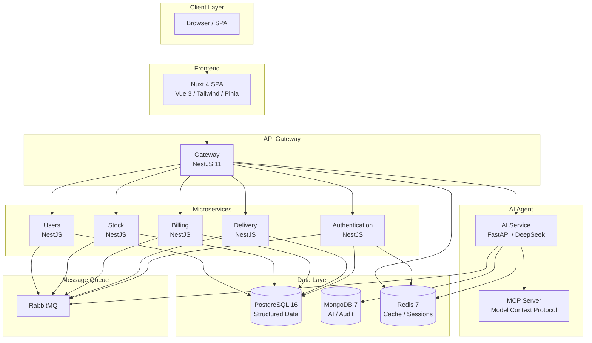
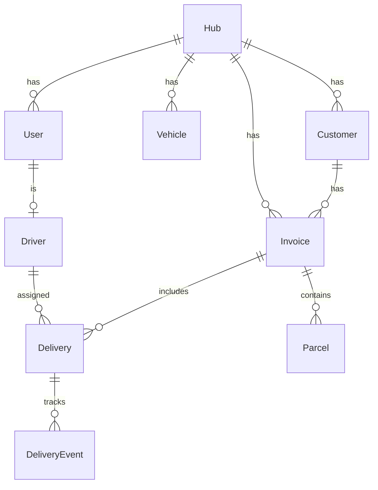

# Transvirex Logistics — Moving Intelligence

[](https://www.transvirex.com) [](LICENSE)

**Transvirex Logistics** est un ERP de gestion logistique conçu dans le cadre d'un **projet de développement web avancé (CESI A4)**. L'application digitalise le transport régional en centralisant les opérations, automatisant la facturation et intégrant un assistant IA.

> 🇫🇷 Projet étudiant à but pédagogique — L'application et ses données sont fictives.
>
> ⚠️ Le développement de cette application à été réalisé par un petit groupe d'étudiants sur 5 jours. Certaines fonctionnalités soient incomplètes et des bugs soient présents. Merci de votre compréhension.

> Fork de https://github.com/cesi-A4-advanced-web/transvirex
>
> Contributeurs :
>
> - [Alec F. (thatsafail)](https://github.com/thatsafail)
> - [Alban G (0xybo)](https://github.com/0xybo)
> - [Achile Coskun (Zaidoudou)](https://github.com/Zaidoudou)
> - Seif-Allah S.

---

## Démo en ligne

Une **version statique** du frontend est déployée sur GitHub Pages :

<div align="center">
  <a href="https://www.transvirex.com"><strong>www.transvirex.com</strong></a>
</div>

Cette version utilise un backend entièrement simulé côté client (mock API) — aucun serveur, base de données ou conteneur nécessaire. Parfaite pour une démonstration rapide.

### Comptes de démonstration

| Rôle                    | Email                     | Mot de passe |
| ----------------------- | ------------------------- | ------------ |
| Administrateur          | admin@transvirex.com      | password     |
| Dispatcher              | dispatcher@transvirex.com | password     |
| Chauffeur               | driver@transvirex.com     | password     |
| Responsable Facturation | billing@transvirex.com    | password     |

---

## Contexte métier

Transvirex Logistics est née d'une idée simple : digitaliser le transport régional. En 5 ans, la société est passée de 12 chauffeurs à plus de 160 collaborateurs indépendants, traitant près de **15 000 livraisons par mois**.

Cette croissance rapide a exposé des limites critiques :

- Les dispatchers jonglent entre WhatsApp, téléphone et e-mails sans vue globale
- Les chauffeurs découvrent les changements de tournée trop tard
- La facturation accuse un retard moyen de 6 jours
- Les réclamations clients augmentent — un client e-commerce majeur a temporairement suspendu son contrat

**Mission** : Concevoir un ERP logistique capable de structurer les flux, centraliser les données, permettre un suivi temps réel, produire des indicateurs fiables et supporter une montée en charge nationale.

---

## Architecture

### Vue d'ensemble



### Schéma de données (Prisma)



---

## Stack technique

| Couche           | Technologie                                                     |
| ---------------- | --------------------------------------------------------------- |
| Frontend         | Nuxt 4 (Vue 3, TypeScript 6), Tailwind CSS 4, shadcn-vue, Pinia |
| Backend          | NestJS 11 monorepo, TypeScript 5.7, Prisma 7                    |
| Agent IA         | Python 3.12, FastAPI, DeepSeek LLM, RAG (MongoDB)               |
| Bases de données | PostgreSQL 16, MongoDB 7, Redis 7                               |
| File de messages | RabbitMQ 3.13                                                   |
| Infrastructure   | Docker, Kubernetes (k3s), Kustomize, Traefik v2.10              |
| CI/CD            | GitHub Actions (8 builds parallèles → déploiement automatique)  |
| Package manager  | pnpm (workspaces)                                               |

---

## Fonctionnalités clés

- **4 tableaux de bord** : Admin, Dispatcher, Chauffeur, Responsable Facturation
- **Suivi temps réel** des livraisons avec mises à jour de statut
- **Assistant IA** : chat conversationnel, détection d'incidents, base de connaissances RAG
- **Facturation automatique** : génération de factures PDF, suivi des paiements
- **Gestion de flotte** : chauffeurs, véhicules, hubs
- **Monitoring** : tableaux de bord santé des services (PostgreSQL, Redis, RabbitMQ, MongoDB)

---

## Structure du projet

```
transvirex/
├── docs/                          # Documentation
│   ├── en/                        # English docs
│   └── fr/                        # Documentation française
├── packages/
│   ├── frontend/                  # Nuxt 4 SPA
│   │   ├── app/
│   │   │   ├── components/        # Composants Vue
│   │   │   ├── composables/       # Composables auto-importés
│   │   │   ├── mock/              # Mock API (version statique)
│   │   │   ├── pages/             # Pages par rôle
│   │   │   ├── plugins/           # Plugins Nuxt
│   │   │   └── stores/            # Stores Pinia
│   │   ├── nuxt.config.ts
│   │   └── pnpm-workspace.yaml
│   └── backend/                   # NestJS monorepo
│       ├── apps/
│       │   ├── gateway/           # API Gateway
│       │   ├── authentication/    # Auth microservice
│       │   ├── delivery/          # Delivery management
│       │   ├── billing/           # Invoicing & billing
│       │   ├── stock/             # Stock management
│       │   ├── users/             # User management
│       │   └── ai/                # Python AI agent (FastAPI)
│       └── libs/
│           ├── database/          # Prisma client
│           ├── guards/            # Auth guards & decorators
│           ├── rabbitmq/          # RabbitMQ client
│           ├── redis/             # Redis client
│           ├── mongodb/           # MongoDB client
│           └── logging/           # Logging utilities
├── kubernetes/                    # Manifests K8s (Kustomize)
├── development/                   # Configuration SSL/nginx local
├── docker-compose.yml             # Orchestration complète
└── .github/workflows/             # CI/CD pipelines
```

---

## Version statique (GitHub Pages)

La branche `static` contient une version allégée du frontend :

- **SSR désactivé** — application 100% côté client
- **API simulée** — interception des appels `/api/*` via un mock JavaScript
- **Aucun serveur requis** — déploiement immédiat sur n'importe quel hébergement statique
- **SSE simulé** — événements temps réel émis périodiquement

### Déploiement

```bash
cd packages/frontend
pnpm install
pnpm generate
# Le dossier dist/public/ est prêt à être déployé
```

---

## Démarrage rapide (développement complet)

### Prérequis

- Node.js ≥ 22
- pnpm ≥ 9
- Docker & Docker Compose
- Python 3.12 (service IA)

### Installation

```bash
git clone https://github.com/0xybo/CESI_A4_DevWebAvance
cd CESI_A4_DevWeb
pnpm install
docker compose up -d postgres rabbitmq redis mongodb
pnpm --filter @transvirex/backend prisma:migrate
pnpm --filter @transvirex/backend prisma:seed
pnpm dev
```

> Voir [docs/en/ONBOARDING.md](docs/en/ONBOARDING.md) pour le guide complet.

---

## Documentation

| Document                                                                 | Description                                    |
| ------------------------------------------------------------------------ | ---------------------------------------------- |
| [Contexte](docs/fr/Contexte.md)                                          | Contexte métier et besoins utilisateurs (FR)   |
| [Analyse des besoins](docs/en/NEEDS_ANALYSIS.md)                         | Business context, user roles, requirements     |
| [Architecture](docs/en/ARCHITECTURE.md)                                  | Architecture système détaillée avec diagrammes |
| [Spécifications techniques](docs/fr/Sp%C3%A9cifications%20techniques.md) | Exigences techniques (FR)                      |
| [Design System](docs/en/Design%20System.md)                              | Charte graphique, typographie, couleurs        |
| [Tests manuels](docs/en/MANUAL_TESTING.md)                               | Scénarios de test par rôle utilisateur         |
| [Onboarding](docs/en/ONBOARDING.md)                                      | Guide d'installation complet                   |

---

## Contribution

Projet étudiant — les contributions externes ne sont pas attendues.  
Consultez [docs/CONTRIBUTING.md](docs/CONTRIBUTING.md) pour les conventions internes.

---

## Licence

Ce projet utilise des outils open source — [Kubernetes](https://kubernetes.io/), [Traefik](https://traefik.io/), [FastAPI](https://fastapi.tiangolo.com/), [DeepSeek](https://deepseek.com/), [NestJS](https://nestjs.com/), [Nuxt](https://nuxt.com/).

Projet réalisé dans le cadre de la formation **CESI A4 — Développement Web Avancé**.

